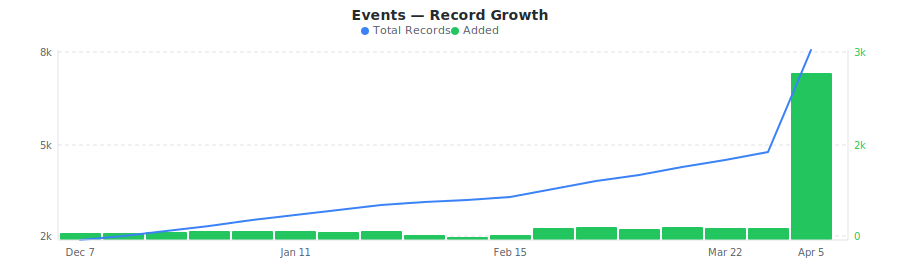
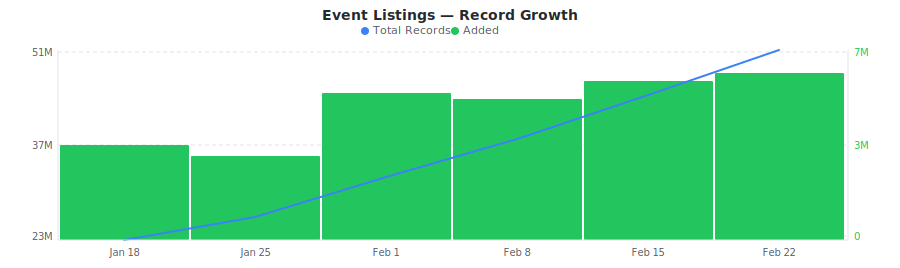
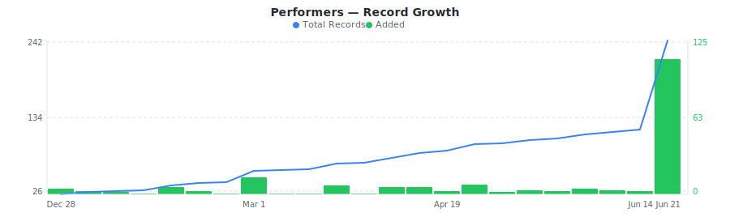
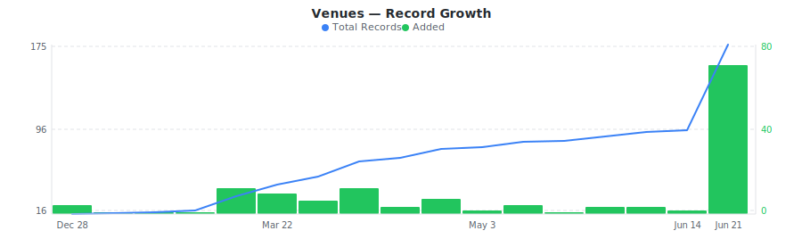

# SeatGeek Events & Ticket Listings Dataset

&nbsp;&nbsp;[](https://rebrowser.net/products/datasets/seatgeek)

Daily sample of SeatGeek events, ticket listings, performers, and venues with Deal Score ratings, section-level seating, delivery types, and cross-platform IDs.


This repository contains a preview sample of the [SeatGeek dataset](https://rebrowser.net/products/datasets/seatgeek) published by Rebrowser. If you're doing academic research, you may be eligible for free access to a much larger slice — see [Free Datasets for Research](https://rebrowser.net/free-datasets-for-research).


This dataset contains **4** entities, each in its own folder: Events (`events`), Event Listings (`event-listings`), Performers (`performers`), Venues (`venues`). See below for a full field breakdown, sample counts, and data distributions for each.

*Found this useful? ⭐ Star this repo to help us keep publishing fresh data. Found an error? [Let us know](https://rebrowser.net/contact-us).*


---

### Events
Daily sample of SeatGeek events with type, taxonomy, venue and performer IDs, schedule status, cross-platform IDs, and seat map availability.


> **7,875** total records from 2025-10-05 to 2026-04-05, **up to 7,875** rows in this sample (100.0% of full dataset).
> Exported as one file per day, up to 1,000 rows each, last 30 days retained.



| Field | Type | Fill Rate | Description |
| --- | --- | --- | --- |
| `_primaryKey` | `string` | 100% | Unique identifier for this record |
| `_firstSeenAt` | `datetime` | 100% | First time this record was seen |
| `_lastSeenAt` | `datetime` | 100% | Last time this record was updated |
| `eventId` | `float` | 100% | Unique event ID (e.g., 17601982) |
| `name` | `string` | 100% | Full event name/title (e.g., NLDS: Chicago Cubs at Milwaukee Brewers) |
| `shortName` | `string` | 100% | Short event name (e.g., NLDS: Cubs at Brewers) |
| `type` | `string` | 100% | Event type (mlb, nba, nhl, nfl, stadium_tours, etc.) |
| `datetimeUtc` | `datetime` | 100% | Event UTC datetime |
| `endDatetimeUtc` | `datetime` | 91% | Event end datetime (UTC) |
| `dateTbd` | `bool` | 100% | Event date is TBD (to be determined) |
| `timeTbd` | `bool` | 100% | Event time is TBD |
| `datetimeTbd` | `bool` | 100% | Event datetime is TBD |
| `status` | `string` | 100% | Event status (normal, postponed, cancelled) |
| `scheduleStatus` | `string` | 100% | Schedule status (as_originally_scheduled, rescheduled) |
| `conditional` | `bool` | 100% | Event is conditional (e.g., playoff games) |
| `contingent` | `bool` | 100% | Event is contingent on other events |
| `isOpen` | `bool` | 100% | Event is open for ticket sales |
| `isVisible` | `bool` | 100% | Event is visible on site |
| `isHybrid` | `bool` | 100% | Event is a hybrid event |
| `eventScore` 🔒 | `float` | 100% | Event score/rank (0-1 scale) |
| `popularityScore` 🔒 | `float` | 100% | Event popularity score (0-1 scale) |
| `url` | `string` | 100% | Full SeatGeek URL for the event |
| `createdAt` | `datetime` | 100% | Event creation timestamp |
| `announceDate` | `datetime` | 100% | Event announcement date |
| `visibleAt` | `datetime` | 100% | When event became visible |
| `visibleUntilUtc` | `datetime` | 100% | When event stops being visible (UTC) |
| `listingCount` 🔒 | `float` | 100% | Number of active ticket listings |
| `ticketCount` 🔒 | `float` | 100% | Total tickets available across listings |
| `averagePrice` 🔒 | `float` | 100% | Average ticket price in dollars |
| `lowestPrice` 🔒 | `float` | 100% | Lowest ticket price in dollars |
| `highestPrice` 🔒 | `float` | 100% | Highest ticket price in dollars |
| `medianPrice` 🔒 | `float` | 100% | Median ticket price in dollars |
| `lowestSgBasePrice` 🔒 | `float` | 100% | Lowest SeatGeek base price in dollars |
| `venueId` | `float` | 100% | Venue ID (join with seatgeek_venues) |
| `performerIds` | `array` | 100% | Performer IDs (join with seatgeek_performers) |
| `taxonomyName` | `string` | 100% | Top-level category (sports, concerts, theater) |
| `taxonomySubName` | `string` | 100% | Sub-category (baseball, basketball, hockey, football) |
| `ticketmasterId` | `string` | 39% | Ticketmaster event ID (for cross-platform matching) |
| `stubhubId` | `string` | 63% | StubHub event ID (for cross-platform matching) |
| `integratedProvider` | `string` | 63% | Integrated ticket provider (OPEN, TICKETMASTER, TDC) |
| `integratedProviderId` | `string` | 63% | Provider-specific event ID |
| `isMapped` | `bool` | 100% | Venue has seat map available |
| `isGa` | `bool` | 100% | Event is general admission |
| `seatSelectionEnabled` | `bool` | 100% | Seat selection is enabled |


> 🔒 **Premium fields** are included in the data files but their values are replaced with `[PREMIUM]`. To access real values, [use our website](https://rebrowser.net/products/datasets/seatgeek).


#### Field Distributions


<details>
<summary><strong>Event Type Distribution</strong> (<code>type</code>)</summary>


| Value | Count | Share |
| --- | --- | --- |
| mlb | 2,984 | `████████░░░░░░░░░░░░` 37.9% |
| nba | 1,659 | `████░░░░░░░░░░░░░░░░` 21.1% |
| nhl | 1,594 | `████░░░░░░░░░░░░░░░░` 20.2% |
| stadium_tours | 1,273 | `███░░░░░░░░░░░░░░░░░` 16.2% |
| nfl | 362 | `█░░░░░░░░░░░░░░░░░░░` 4.6% |
| baseball | 3 | `░░░░░░░░░░░░░░░░░░░░` 0.0% |

</details>


<details>
<summary><strong>Top-Level Event Category</strong> (<code>taxonomyName</code>)</summary>


| Value | Count | Share |
| --- | --- | --- |
| sports | 7,875 | `████████████████████` 100.0% |

</details>


<details>
<summary><strong>Event Status</strong> (<code>status</code>)</summary>


| Value | Count | Share |
| --- | --- | --- |
| normal | 7,875 | `████████████████████` 100.0% |

</details>


---

### Event Listings
Daily sample of SeatGeek ticket listings with section, row, quantity, delivery type, marketplace, and deal bucket per event.


> **31,349,410** total records from 2025-10-05 to 2026-02-08, **up to 30,000** rows in this sample (0.10% of full dataset).
> Exported as one file per day, up to 1,000 rows each, last 30 days retained.



| Field | Type | Fill Rate | Description |
| --- | --- | --- | --- |
| `_primaryKey` | `string` | 100% | Unique identifier for this record |
| `_firstSeenAt` | `datetime` | 100% | First time this record was seen |
| `_lastSeenAt` | `datetime` | 100% | Last time this record was updated |
| `listingId` | `string` | 100% | Unique listing ID (e.g., qVjH2vAdbzA, 05VT8679aVX) |
| `eventId` | `string` | 100% | Event ID this listing belongs to (join with seatgeek_events) |
| `price` 🔒 | `float` | 100% | Ticket price in dollars before fees |
| `priceWithFees` 🔒 | `float` | 100% | Total ticket price in dollars with fees |
| `fee` 🔒 | `float` | 100% | Fee amount in dollars |
| `section` | `string` | 100% | Section name/number (e.g., 101, 506WC, C129) |
| `sectionFull` | `string` | 100% | Full section name including tier/level (e.g., Section 101, Club 129, Section 506 WC) |
| `row` | `string` | 100% | Row within section - can be numeric (1-50+) or letter (a-z, w, h) |
| `quantity` | `float` | 100% | Number of tickets available in this listing, typically 1-20 |
| `seats` | `array` | 26% | Specific seat numbers if assigned, empty array if GA/unassigned |
| `inHandDate` | `datetime` | 99% | Date when tickets will be in hand for delivery |
| `deliveryType` | `string` | 100% | Ticket delivery method: electronic, sg_app, shipped, local |
| `marketplace` | `string` | 100% | Ticket marketplace/seller: exchange, open_marketplace, marketplace, open, fan_to_fan |
| `dealBucket` | `float` | 100% | Deal quality bucket: 0=Amazing, 1=Great, 2=Good, 3=Okay, 4-6=Price tiers, 7=Other |
| `dealScore` 🔒 | `float` | 99% | Deal quality score 0-10, higher=better value |
| `splitType` | `string` | 100% | How tickets can be split - comma-separated quantities (e.g., "2", "1,2,4") |


> 🔒 **Premium fields** are included in the data files but their values are replaced with `[PREMIUM]`. To access real values, [use our website](https://rebrowser.net/products/datasets/seatgeek).


#### Field Distributions


<details>
<summary><strong>Listing Marketplace</strong> (<code>marketplace</code>)</summary>


| Value | Count | Share |
| --- | --- | --- |
| exchange | 30,907,421 | `████████████████████` 98.6% |
| open | 242,441 | `░░░░░░░░░░░░░░░░░░░░` 0.8% |
| open_marketplace | 116,290 | `░░░░░░░░░░░░░░░░░░░░` 0.4% |
| marketplace | 73,186 | `░░░░░░░░░░░░░░░░░░░░` 0.2% |
| fan_to_fan | 10,072 | `░░░░░░░░░░░░░░░░░░░░` 0.0% |

</details>


<details>
<summary><strong>Delivery Type</strong> (<code>deliveryType</code>)</summary>


| Value | Count | Share |
| --- | --- | --- |
| electronic | 28,528,394 | `██████████████████░░` 91.0% |
| sg_app | 2,812,129 | `██░░░░░░░░░░░░░░░░░░` 9.0% |
| shipped | 8,666 | `░░░░░░░░░░░░░░░░░░░░` 0.0% |
| local | 221 | `░░░░░░░░░░░░░░░░░░░░` 0.0% |

</details>


---

### Performers
SeatGeek performers including teams, artists, and acts with type, taxonomy, division, popularity score, and home venue.


> **230** total records from 2025-10-05 to 2026-04-05, **230** rows in this sample (100.0% of full dataset).
> Exported as a single file, overwritten daily.



| Field | Type | Fill Rate | Description |
| --- | --- | --- | --- |
| `_primaryKey` | `string` | 100% | Unique identifier for this record |
| `_firstSeenAt` | `datetime` | 100% | First time this record was seen |
| `_lastSeenAt` | `datetime` | 100% | Last time this record was updated |
| `performerId` | `float` | 100% | Unique performer ID (e.g., 11, 793010) |
| `name` | `string` | 100% | Full performer name (e.g., Chicago Cubs, MLB Postseason) |
| `shortName` | `string` | 100% | Short name (e.g., Cubs, Dodgers) |
| `type` | `string` | 100% | Performer type (mlb, nba, nhl, nfl, etc.) |
| `slug` | `string` | 100% | URL-friendly slug (e.g., chicago-cubs) |
| `url` | `string` | 100% | Full SeatGeek URL for the performer |
| `heroImageUrl` 🔒 | `string` | 100% | Hero/large image URL |
| `bannerImageUrl` 🔒 | `string` | 100% | Banner image URL |
| `score` | `float` | 100% | Performer score (0-1 scale) |
| `popularity` | `float` | 100% | Performer popularity score (raw count) |
| `homeVenueId` | `float` | 57% | Home venue ID (for teams) |
| `primaryColor` | `string` | 57% | Primary brand color hex (e.g., #0E3386) |
| `iconicColor` | `string` | 57% | Iconic brand color hex |
| `isEvent` | `bool` | 100% | Is an event/competition performer (e.g., playoffs, series) |
| `divisionName` | `string` | 54% | Division display name (e.g., National League Central) |
| `divisionShortName` | `string` | 54% | Division short name (e.g., NL Central) |
| `taxonomyName` | `string` | 100% | Top-level category (sports, concerts, theater) |
| `taxonomySubName` | `string` | 99% | Sub-category (baseball, basketball, hockey, football) |


> 🔒 **Premium fields** are included in the data files but their values are replaced with `[PREMIUM]`. To access real values, [use our website](https://rebrowser.net/products/datasets/seatgeek).


#### Field Distributions


<details>
<summary><strong>Performer Type</strong> (<code>type</code>)</summary>


| Value | Count | Share |
| --- | --- | --- |
| nfl | 60 | `█████░░░░░░░░░░░░░░░` 26.1% |
| nba | 47 | `████░░░░░░░░░░░░░░░░` 20.4% |
| mlb | 47 | `████░░░░░░░░░░░░░░░░` 20.4% |
| nhl | 43 | `████░░░░░░░░░░░░░░░░` 18.7% |
| baseball | 19 | `██░░░░░░░░░░░░░░░░░░` 8.3% |
| stadium_tours | 5 | `░░░░░░░░░░░░░░░░░░░░` 2.2% |
| minor_league_baseball | 4 | `░░░░░░░░░░░░░░░░░░░░` 1.7% |
| band | 2 | `░░░░░░░░░░░░░░░░░░░░` 0.9% |
| ncaa_baseball | 2 | `░░░░░░░░░░░░░░░░░░░░` 0.9% |
| basketball | 1 | `░░░░░░░░░░░░░░░░░░░░` 0.4% |

</details>


---

### Venues
SeatGeek venues with name, full address, city, state, country, GPS coordinates, capacity, and popularity score.


> **167** total records from 2025-10-05 to 2026-04-05, **167** rows in this sample (100.0% of full dataset).
> Exported as a single file, overwritten daily.



| Field | Type | Fill Rate | Description |
| --- | --- | --- | --- |
| `_primaryKey` | `string` | 100% | Unique identifier for this record |
| `_firstSeenAt` | `datetime` | 100% | First time this record was seen |
| `_lastSeenAt` | `datetime` | 100% | Last time this record was updated |
| `venueId` | `float` | 100% | Unique venue ID (e.g., 15, 181) |
| `name` | `string` | 100% | Venue name (e.g., American Family Field, Capital One Arena) |
| `slug` | `string` | 100% | URL-friendly slug (e.g., american-family-field) |
| `url` | `string` | 100% | Full SeatGeek URL for the venue |
| `addressStreet` | `string` | 96% | Street address (e.g., 1 Brewers Way) |
| `addressCity` | `string` | 100% | City name (e.g., Milwaukee) |
| `addressState` | `string` | 98% | State/province code (e.g., WI, ON) |
| `addressCountry` | `string` | 99% | Country (US, Canada, Germany, UK) |
| `addressPostalCode` | `string` | 98% | Postal/ZIP code (e.g., 53214) |
| `timezone` | `string` | 100% | IANA timezone (e.g., America/Chicago) |
| `latitude` | `float` | 100% | Venue latitude coordinate |
| `longitude` | `float` | 100% | Venue longitude coordinate |
| `capacity` | `float` | 100% | Venue seating capacity |
| `score` | `float` | 100% | Venue score (0-1 scale) |
| `popularity` | `float` | 100% | Venue popularity score (raw count) |
| `metroCode` | `float` | 100% | Metro area code |


#### Field Distributions


<details>
<summary><strong>Venue Countries</strong> (<code>addressCountry</code>)</summary>


| Value | Count | Share |
| --- | --- | --- |
| US | 152 | `██████████████████░░` 91.6% |
| Canada | 10 | `█░░░░░░░░░░░░░░░░░░░` 6.0% |
| UK | 2 | `░░░░░░░░░░░░░░░░░░░░` 1.2% |
| Mexico | 1 | `░░░░░░░░░░░░░░░░░░░░` 0.6% |
| Germany | 1 | `░░░░░░░░░░░░░░░░░░░░` 0.6% |

</details>


---

## Pre-built Views on Rebrowser

Rebrowser web viewer lets you filter, sort, and export any slice of this dataset interactively. These pre-built views are ready to open:


### Events


[Events with Pricing Data](https://rebrowser.net/products/datasets/seatgeek/events/views/events-with-pricing-data) — 7,875 records

↳ `[{"field":"averagePrice","op":"gt","value":0},{"sort":"averagePrice DESC"}]`

[Sports Events](https://rebrowser.net/products/datasets/seatgeek/events/views/sports-events) — 7,875 records

↳ `[{"field":"taxonomyName","op":"is","value":"sports"},{"sort":"datetimeUtc ASC"}]`

[Events Open for Ticket Sales](https://rebrowser.net/products/datasets/seatgeek/events/views/open-for-sale-events) — 1,609 records

↳ `[{"field":"isOpen","op":"isTrue"},{"sort":"datetimeUtc ASC"}]`

[MLB Baseball Events](https://rebrowser.net/products/datasets/seatgeek/events/views/mlb-events) — 2,984 records

↳ `[{"field":"type","op":"is","value":"mlb"},{"sort":"datetimeUtc ASC"}]`

[NBA Basketball Events](https://rebrowser.net/products/datasets/seatgeek/events/views/nba-events) — 1,659 records

↳ `[{"field":"type","op":"is","value":"nba"},{"sort":"datetimeUtc ASC"}]`


*[See all 24 views →](https://rebrowser.net/products/datasets/seatgeek/events)*


### Event Listings


[Listings with Deal Score](https://rebrowser.net/products/datasets/seatgeek/event-listings/views/listings-with-deal-score) — 27,340,000 records

↳ `[{"field":"dealScore","op":"gt","value":0},{"sort":"dealScore DESC"}]`

[Best Deal Listings (Deal Score 8+)](https://rebrowser.net/products/datasets/seatgeek/event-listings/views/best-deal-listings) — 12,721,146 records

↳ `[{"field":"dealScore","op":"gte","value":8},{"sort":"dealScore DESC"}]`

[Listings by Price (Low to High)](https://rebrowser.net/products/datasets/seatgeek/event-listings/views/listings-by-price-low) — 27,340,000 records

↳ `[{"sort":"price ASC"}]`

[Listings by Price (High to Low)](https://rebrowser.net/products/datasets/seatgeek/event-listings/views/listings-by-price-high) — 27,340,000 records

↳ `[{"sort":"price DESC"}]`

[Electronic Delivery Listings](https://rebrowser.net/products/datasets/seatgeek/event-listings/views/electronic-delivery-listings) — 25,159,243 records

↳ `[{"field":"deliveryType","op":"is","value":"electronic"},{"sort":"price ASC"}]`


*[See all 25 views →](https://rebrowser.net/products/datasets/seatgeek/event-listings)*


### Performers


[Sports Performers](https://rebrowser.net/products/datasets/seatgeek/performers/views/sports-performers) — 228 records

↳ `[{"field":"taxonomyName","op":"is","value":"sports"},{"sort":"name ASC"}]`

[MLB Performers](https://rebrowser.net/products/datasets/seatgeek/performers/views/mlb-performers) — 47 records

↳ `[{"field":"type","op":"is","value":"mlb"},{"sort":"name ASC"}]`

[NBA Performers](https://rebrowser.net/products/datasets/seatgeek/performers/views/nba-performers) — 47 records

↳ `[{"field":"type","op":"is","value":"nba"},{"sort":"name ASC"}]`

[NHL Performers](https://rebrowser.net/products/datasets/seatgeek/performers/views/nhl-performers) — 43 records

↳ `[{"field":"type","op":"is","value":"nhl"},{"sort":"name ASC"}]`

[NFL Performers](https://rebrowser.net/products/datasets/seatgeek/performers/views/nfl-performers) — 60 records

↳ `[{"field":"type","op":"is","value":"nfl"},{"sort":"name ASC"}]`


*[See all 18 views →](https://rebrowser.net/products/datasets/seatgeek/performers)*


### Venues


[Venues by Capacity](https://rebrowser.net/products/datasets/seatgeek/venues/views/venues-by-capacity) — 167 records

↳ `[{"field":"capacity","op":"gt","value":0},{"sort":"capacity DESC"}]`

[Venues in United States](https://rebrowser.net/products/datasets/seatgeek/venues/views/venues-united-states) — 152 records

↳ `[{"field":"addressCountry","op":"is","value":"US"},{"sort":"addressState ASC"}]`

[Venues in California](https://rebrowser.net/products/datasets/seatgeek/venues/views/venues-california) — 14 records

↳ `[{"field":"addressState","op":"is","value":"CA"},{"sort":"name ASC"}]`

[Venues in Florida](https://rebrowser.net/products/datasets/seatgeek/venues/views/venues-florida) — 23 records

↳ `[{"field":"addressState","op":"is","value":"FL"},{"sort":"name ASC"}]`

[Venues in Arizona](https://rebrowser.net/products/datasets/seatgeek/venues/views/venues-arizona) — 15 records

↳ `[{"field":"addressState","op":"is","value":"AZ"},{"sort":"name ASC"}]`


*[See all 19 views →](https://rebrowser.net/products/datasets/seatgeek/venues)*


---

## Code Examples

```python
import pandas as pd
from pathlib import Path

# ── Performers (dimension table) ─────────────────────────────────────────────
performers = pd.read_parquet('rebrowser/seatgeek-dataset/performers/data.parquet')

# Top 20 performers by popularity
print(performers.nlargest(20, 'popularity')[['name', 'type', 'taxonomyName', 'popularity']]
      .to_string(index=False))

# Count performers per type (mlb, nba, nhl, nfl, ...)
print(performers['type'].value_counts().head(15).to_string())

# Sports performers with a home venue
home_teams = performers[performers['homeVenueId'].notna()]
print(home_teams[['name', 'type', 'divisionShortName', 'homeVenueId']].sort_values('type'))

# ── Venues (dimension table) ─────────────────────────────────────────────────
venues = pd.read_parquet('rebrowser/seatgeek-dataset/venues/data.parquet')

# Largest venues by capacity
print(venues.nlargest(15, 'capacity')[['name', 'addressCity', 'addressState', 'capacity']]
      .to_string(index=False))

# Venue count by state
print(venues['addressState'].value_counts().head(15).to_string())

# ── Events (daily append) ────────────────────────────────────────────────────
files = sorted(Path('rebrowser/seatgeek-dataset/events/data').glob('*.parquet'))[-7:]
events = pd.concat([pd.read_parquet(f) for f in files])

# Events by type
print(events['type'].value_counts().head(15).to_string())

# Upcoming sports events with normal status
sports = events[(events['taxonomyName'] == 'sports') & (events['status'] == 'normal')]
print(sports[['name', 'type', 'datetimeUtc', 'venueId']].head(20).to_string(index=False))

# Events with cross-platform Ticketmaster IDs
tm_events = events[events['ticketmasterId'].notna()]
print(f"Events with Ticketmaster ID: {len(tm_events)} / {len(events)}")

# ── Event Listings (daily append) ────────────────────────────────────────────
files = sorted(Path('rebrowser/seatgeek-dataset/event-listings/data').glob('*.parquet'))[-7:]
listings = pd.concat([pd.read_parquet(f) for f in files])

# Distribution of delivery types
print(listings['deliveryType'].value_counts().to_string())

# Listings by marketplace
print(listings['marketplace'].value_counts().to_string())

# Average quantity per listing by delivery type
print(listings.groupby('deliveryType')['quantity'].mean().round(1).to_string())
```

---

## Use Cases


### Cross-Platform Event Matching

Use ticketmasterId and stubhubId fields to match events across SeatGeek, Ticketmaster, and StubHub. Build cross-marketplace comparisons and inventory analysis.


### Venue Capacity Analysis

Combine venue capacity data with event listing counts to study sell-through rates. Compare demand patterns across venue sizes, states, and time zones.


### Delivery Method Research

Analyze how electronic vs. shipped vs. app delivery options distribute across event types and marketplaces. Study the industry shift toward mobile ticketing.


### Performer Demand Tracking

Join events with performers to measure which artists and teams generate the most listings. Rank performers by event frequency and marketplace activity.


---

## Full Dataset on Rebrowser


This repo is a 1,000-row preview sample. The full dataset is at [rebrowser.net/products/datasets/seatgeek](https://rebrowser.net/products/datasets/seatgeek)

Doing academic research? You may qualify for free access to a larger slice. See [Free Datasets for Research](https://rebrowser.net/free-datasets-for-research).

On Rebrowser you can:
- **Filter before you buy** — use the web UI to apply filters on any field and sort by any column. Preview results before purchasing. You only pay for records that match your criteria.
- **Export in your format** — CSV, JSON, JSONL, or Parquet depending on your plan.
- **Access via API** — integrate dataset queries into your pipelines and workflows.
- **Choose your freshness** — plans range from a 14-day lag to real-time data with no delay.
- **Select only the fields you need** — keep exports lean. Premium fields with richer data are available on higher plans.

[Pricing](https://rebrowser.net/pricing) starts at **$2 per 1,000 rows** with volume discounts.

---

## License & Terms

**Free for research and non-commercial use** with attribution. See [license terms](https://rebrowser.net/free-datasets-for-research#license) and [how to cite](https://rebrowser.net/free-datasets-for-research#citation).

```bibtex
@misc{rebrowser_seatgeek,
  author       = {Rebrowser},
  title        = {SeatGeek Events & Ticket Listings Dataset},
  year         = {2026},
  howpublished = {\url{https://rebrowser.net/products/datasets/seatgeek}},
  note         = {Accessed: YYYY-MM-DD}
}
```

Commercial use requires a paid license — see [pricing](https://rebrowser.net/pricing). Use of this data is governed by the [Rebrowser Terms of Use](https://rebrowser.net/terms-of-use), which may be updated at any time independently of this repository.

---

## Disclaimer

Rebrowser is an independent data provider and is not affiliated with, endorsed by, or sponsored by SeatGeek. Any trademarks are the property of their respective owners. This dataset is compiled from publicly available information; we do not request or collect SeatGeek user credentials. By using this dataset, you agree to comply with SeatGeek's Terms of Service and all applicable laws and regulations. Images, logos, descriptions, and other materials included in this dataset remain the intellectual property of their respective owners and are provided solely for informational purposes. Rebrowser makes no warranties regarding the accuracy, completeness, or legality of the data and assumes no liability for how the data is used. You are solely responsible for ensuring that your use of this dataset does not infringe on the rights of any third party.


You can also find this data on [Kaggle](https://www.kaggle.com/datasets/rebrowser/seatgeek-dataset), [HuggingFace](https://huggingface.co/datasets/rebrowser/seatgeek-dataset), [Zenodo](https://doi.org/10.5281/zenodo.18854665).


